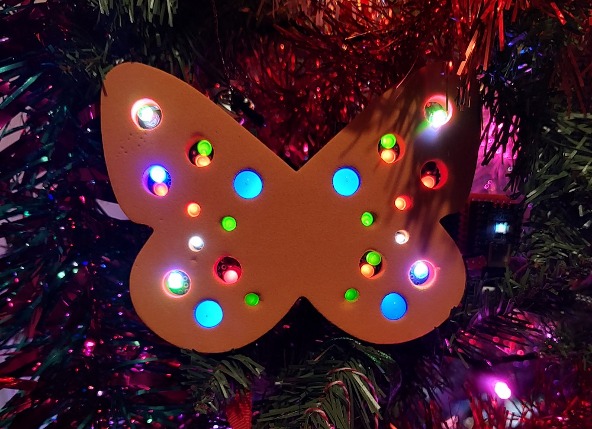
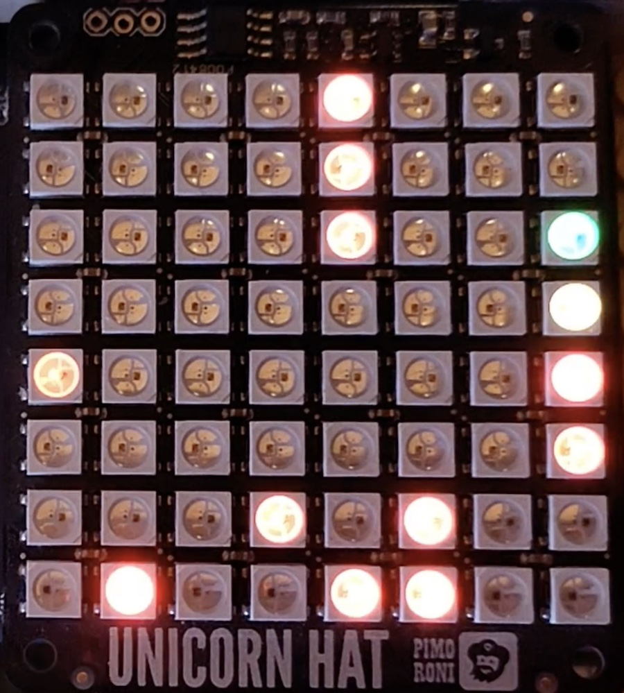

# jam_2023
Projects demonstrated at the Coventry and Warwickshire Raspberry Jam, December 2023

## LED Butterfly

A flashing light decoration based around the Pico, with code in micro-python.

## Spectrum Analyser

A Pi2 based 2D spectrum analyzer, using a microcontroller for analogue input and a
8x8 LED matrix for output

## Geiger Counter plotter