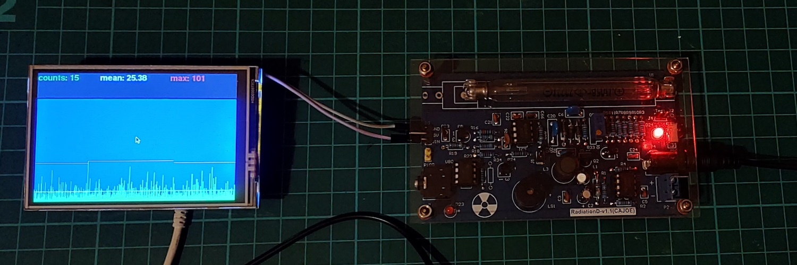

# Raspberry Pi Geiger Counter

A Geiger counter display using a Pi zero and a cheap geiger counter kit.

## Connections

The geiger counter has a _signal out_ pin which fortunately is a pi compatible 3.3v,
which is normally held high but drops when a detection occurs.

The screen attaches to the GPIO header leaving a few pins free.

## Software

* `pygame` was used to provide the graphics.
* An instantaneous value was calculated using the time taken to record 5 pulses
* Maximum and mean values are plotted on top of the counts.
