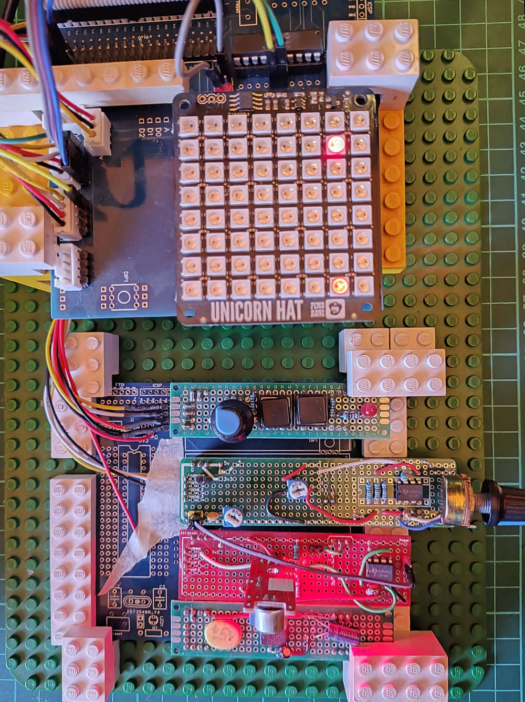

# Pi based Spectrum Analyzer

Displays a 3D audio spectrum on an 8x8 LED matrix display.

## Description of the system

From top to bottom:
1. Microcontroller - reads an analogue signal and sends it to the Pi through the serial port
2. Raspberry Pi with the Pimoroni Unicorn Hat on top
3. Board with a potentiometer, 2 buttons and an LED:
   * Potentiometer is read by the microcontroller to adjust the sample rate
   * First button adjusts the FFT width
   * Second button changes the scale used to calculate the LED intensity and colour
   * LED lights up if the signal saturates
4. Amplifier with gain and offset so the signal can be shifted to fit within the 0-3.3v range expected
5. Microphone
6. Voltage regulator for the amplifier, providing a -5v supply.

## The Code

The microcontroller code is written for a PIC 16F18344 but should be easy to adapt for a similar
chip. It is very straightforward and shouldn't be too hard to re-write to run on something else,
such as a member of the Arduino family or even a raspberry pi pico. The main thing to be aware of is
that the Pi should only have 3.3V applied to a GPIO pin.
* Reads the ADC and sends the value to the serial port
* Reads the potentiometer and pauses according to the value (so changing the potentiometer adjusts the sample rate)

The Raspberry Pi code is written in python and reads in a block of values, performs an FFT
(using the `scipy` library) and uses the results to set the colours and intensities of the LED matrix. 